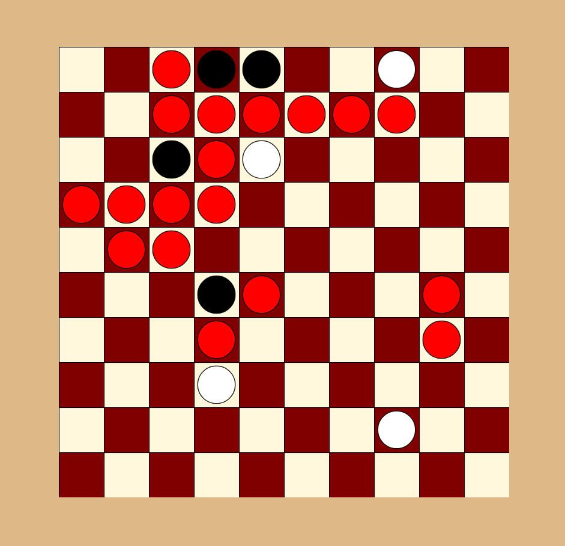

# Game of the Amazons

A web version of [Game of the Amazons](https://en.wikipedia.org/wiki/Game_of_the_Amazons)

# How to run
You simply open the [index.html](./index.html) file in your browser.
Or you run a simple http server in the root folder of the repo e.g. (in python) `python -m http.server` 

The first time it is started it will be automatically configured for 1 player. 
To switch to 2 player mode you press `a`.

# Rules
Game of the Amazons has quite simple rules. 
The goal of the game is to make sure your oponent cannot move any of his/her pawns. 
Every player takes turns to reach this goal. 
Each turn consist of 2 actions: 
    1. Moving the pawn: a pawn can move horizontally, vertically or diagonally as far as it can go until it is blocked by either the board edge, a pawn from the openent or an obstruction (red pawn).
    2. Setting an obstruction: when a pawn is placed it can shoot an obstruction with the same restrictions as a pawn to block the movement of the openents pawns. An obstruction has a red color (see image above).
    
The game continues until one of the 2 players cannot move any of his/her pawns.
